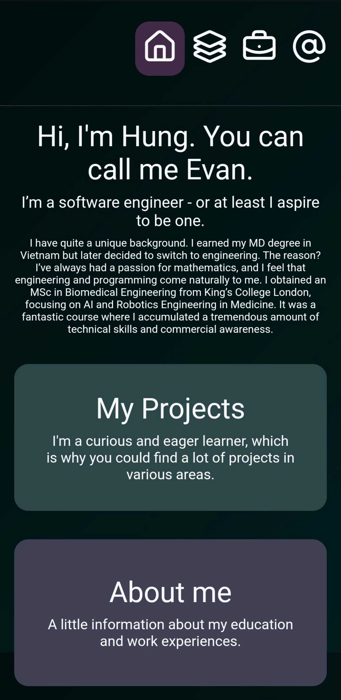

# Portfolio

This is my portfolio page.

It's a 3-day project completed with React.

There's a CI/CD pipeline located in [.github/workflows/main-deploy.yml](.github/workflows/main-deploy.yml).

The website is designed for scalability, allowing me to add more projects, work experience, and education later by modifying the files in [src/portfolio_data/](src/portfolio_data/).

## Chatbot

The chatbot is added later.

The chatbot was added later.

The code can be found in the [backend](backend), which is deployed on AWS Lambda. It is written in Node.js and communicates with the frontend via API Gateway WebSocket.

